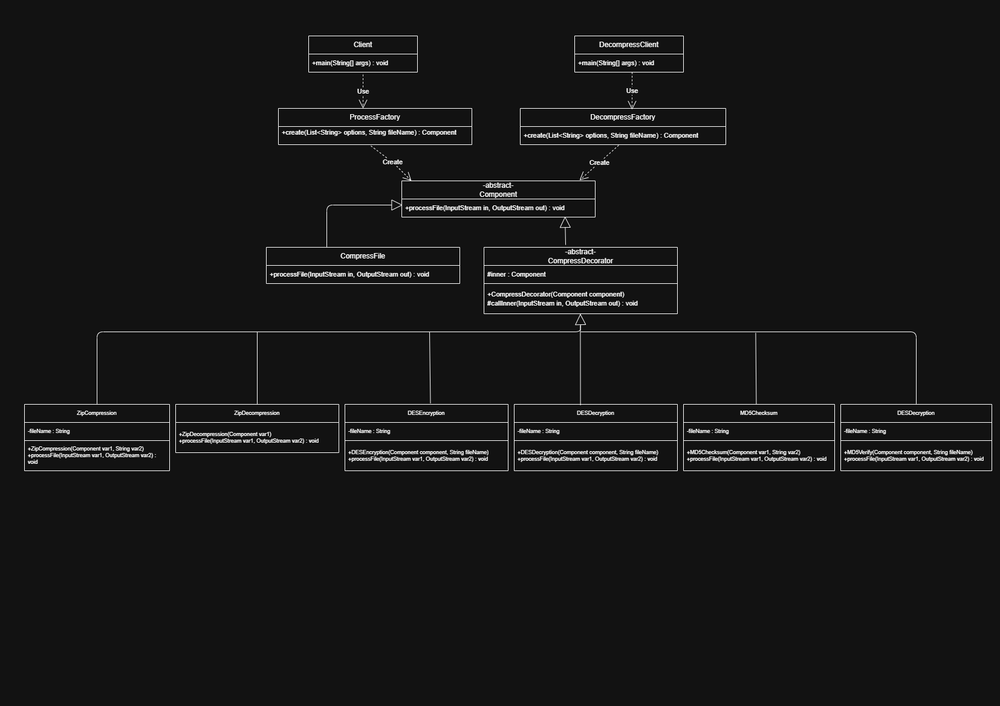

# Implement_Decorator

##Compress and Encryption
  >jcompress a.txt -zip -des -md5
you with got <filename>.key, <filename>.md5 amd <filename>.zip

##Decompress and Decryption
  >jdecompress a.txt.zip -zip -des -md5

***option order is important***

# Class Diagram
